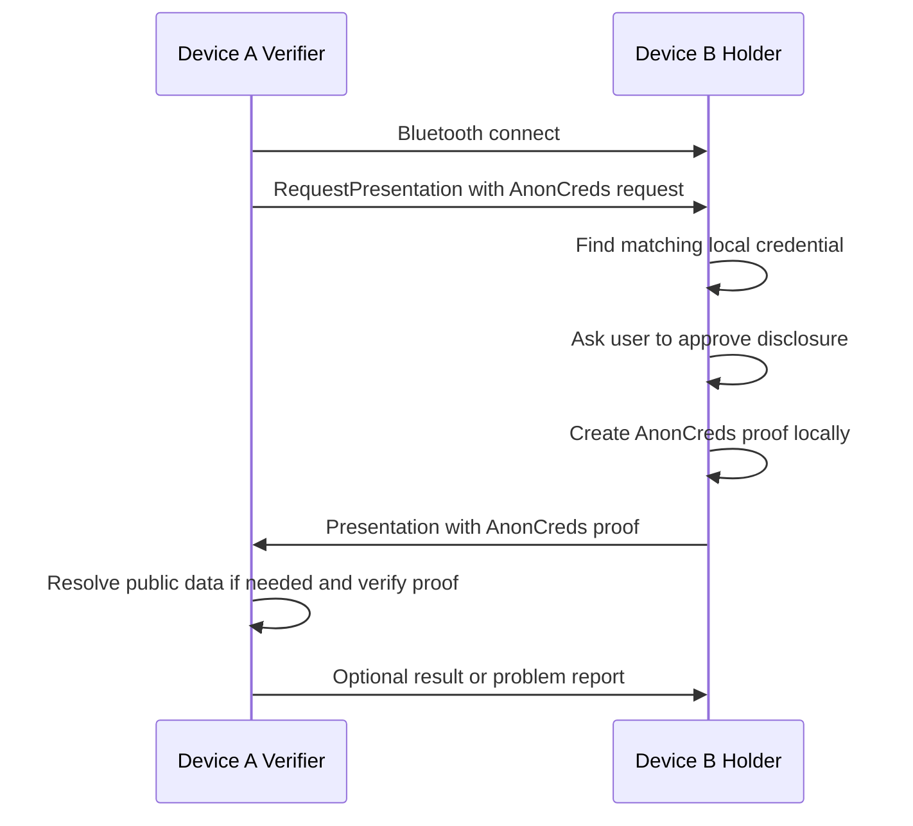
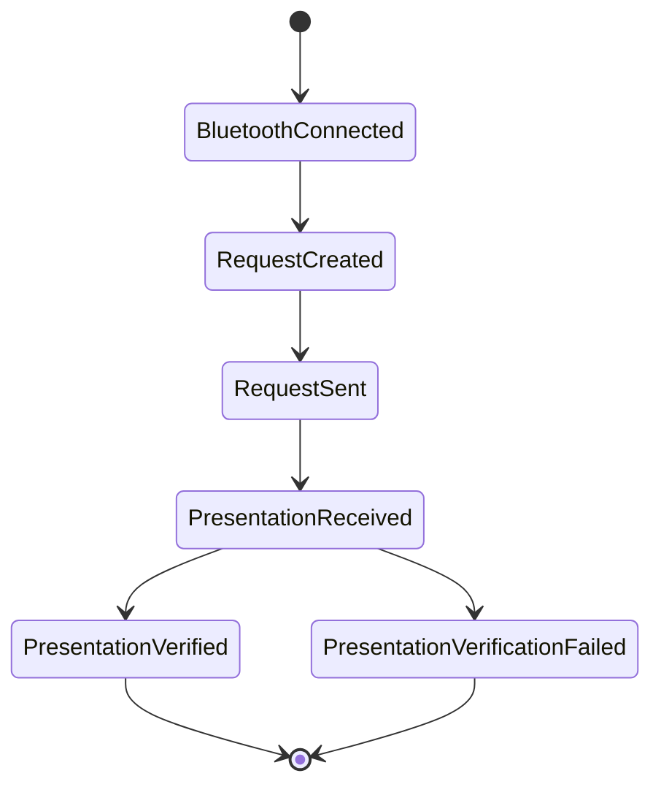
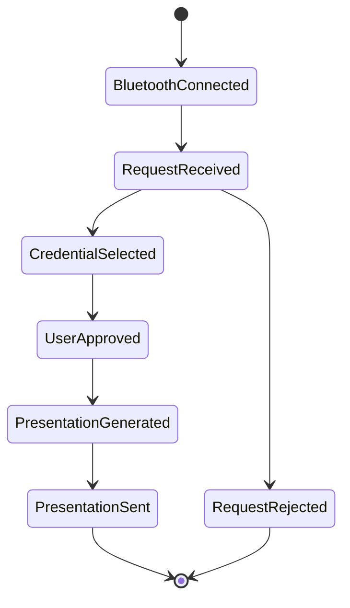

# Bluetooth Device-to-Device AnonCreds Present-Proof Flow

This document describes the local verification flow for two mobile devices connected directly through Bluetooth. It is based on the existing present-proof flow, but removes the cloud agent, HTTP API, public DIDComm endpoint, OOB URL, and server-side background jobs from the holder-verifier message exchange.

The holder-verifier message exchange happens locally:

- Device A is the verifier.
- Device B is the holder/prover.
- Bluetooth is the message transport.
- The holder already has an AnonCreds credential stored locally.
- The verifier may use internet or local network access to load schema and credential definition data needed to verify the proof.
- No issuer call is made during proof verification.
- The holder does not need internet access during the proof exchange.

## Goal

Device A asks Device B to prove that it owns a credential matching an AnonCreds proof request. Device B selects a matching local credential, generates an AnonCreds proof locally, and sends the proof back over Bluetooth. Device A verifies the proof in the verifier app, using local cache or verifier-side network resolution for public AnonCreds data when needed.

## Important Difference From Cloud Flow

In the cloud-agent flow, the verifier creates an OOB invitation with an encoded `_oob` URL. The holder accepts the invitation through an API, and background jobs send DIDComm messages through configured endpoints.

In this Bluetooth flow, there is no `_oob` URL and no server endpoint between the two devices. The verifier sends the proof request directly to the holder over the Bluetooth session.

The logical messages are still the same:

- `RequestPresentation`
- `Presentation`
- Optional `ProblemReport`

Only the transport changes.

## Version 1 Network Assumption

For the first version, Device B, the holder, is offline. Device B only needs Bluetooth and its local wallet.

Device A, the verifier, may have internet or local network access. This allows Device A to resolve public AnonCreds artifacts such as schema and credential definition URLs during verification.

Example credential definition identifier:

```text
http://192.168.1.6:8085/credential-definition-registry/definitions/49fdd8e1-a5ac-3469-a2fe-87cfb5d7c607/definition
```

This network access is only for verifier-side verification data. It is not used to send proof messages between devices, and the holder still does not call a server.

## Local Requirements

Before the local proof flow starts:

1. Device B must already store the issued AnonCreds credential.
2. Device B must already have its link secret.
3. Device A must be able to obtain the AnonCreds schema and credential definition needed for verification, either from local cache or through its network connection.
4. If revocation is required, Device A must also be able to obtain the required revocation registry/status data.
5. Both devices must establish a secure local Bluetooth session.

Device B must not depend on internet access. All credential selection and proof generation on Device B must use local wallet data.

## High-Level Flow



## State Flow

### Verifier Device



### Holder Device



## Message 1: Verifier Sends Proof Request

Device A creates an AnonCreds presentation request. This is the local equivalent of the `anoncredPresentationRequest` inside `RequestPresentationInput`.

Example request payload:

```json
{
  "id": "request-uuid",
  "type": "present-proof/request-presentation",
  "thid": "thread-uuid",
  "from": "device-a-local-did-or-session-id",
  "to": "device-b-local-did-or-session-id",
  "credentialFormat": "AnonCreds",
  "presentationFormat": "anoncreds/proof-request@v1.0",
  "anoncredPresentationRequest": {
    "requested_attributes": {
      "attr1": {
        "name": "firstName",
        "restrictions": [
          {
            "cred_def_id": "http://192.168.1.6:8085/credential-definition-registry/definitions/49fdd8e1-a5ac-3469-a2fe-87cfb5d7c607/definition"
          }
        ],
        "non_revoked": null
      }
    },
    "requested_predicates": {
      "predicate1": {
        "name": "age",
        "p_type": ">=",
        "p_value": 18,
        "restrictions": [
          {
            "cred_def_id": "http://192.168.1.6:8085/credential-definition-registry/definitions/49fdd8e1-a5ac-3469-a2fe-87cfb5d7c607/definition"
          }
        ],
        "non_revoked": null
      }
    },
    "name": "Local proof request",
    "nonce": "1234567890",
    "version": "1.0",
    "non_revoked": null
  }
}
```

The important part is `anoncredPresentationRequest`. It tells the holder which attributes or predicates must be proven.

## Message 2: Holder Selects Matching Credential

Device B receives the request and searches local wallet storage for a credential that satisfies:

- requested attribute names
- requested predicates
- schema restrictions
- credential definition restrictions
- optional non-revocation requirements

The app should show the matching credential and the requested disclosure to the user. Nothing should be sent back until the user approves.

The holder-side credential selection is equivalent to this structure:

```json
{
  "credentialProofs": [
    {
      "credential": "local-issued-credential-record-id",
      "requestedAttribute": ["attr1"],
      "requestedPredicate": ["predicate1"]
    }
  ]
}
```

## Message 3: Holder Generates Proof

After user approval, Device B creates the AnonCreds presentation locally.

Inputs:

- the received AnonCreds presentation request
- the selected credential
- the holder link secret
- the schema data
- the credential definition data
- revocation data, if required

Conceptually this maps to:

```scala
AnoncredLib.createPresentation(
  presentationRequest,
  selectedCredentials,
  revocationStates,
  linkSecret,
  schemaMap,
  credentialDefinitionMap
)
```

The issuer is not contacted. The proof is generated from the holder's stored credential and link secret.

## Message 4: Holder Sends Presentation Back

Device B sends the generated proof to Device A over the same Bluetooth session.

Example response payload:

```json
{
  "id": "presentation-uuid",
  "type": "present-proof/presentation",
  "thid": "thread-uuid",
  "from": "device-b-local-did-or-session-id",
  "to": "device-a-local-did-or-session-id",
  "credentialFormat": "AnonCreds",
  "presentationFormat": "anoncreds/proof@v1.0",
  "anoncredPresentation": {
    "proof": "...",
    "requested_proof": {},
    "identifiers": []
  }
}
```

The actual `anoncredPresentation` body is the serialized proof produced by the AnonCreds library.

## Message 5: Verifier Verifies Proof Locally

Device A verifies the received presentation against the original request.

Inputs:

- original AnonCreds presentation request
- received AnonCreds presentation
- schema map
- credential definition map
- revocation registry/status data, if required

Conceptually this maps to:

```scala
AnoncredLib.verifyPresentation(
  presentation,
  presentationRequest,
  schemaMap,
  credentialDefinitionMap
)
```

If verification succeeds, Device A marks the local flow as `PresentationVerified`. If verification fails, it marks the flow as `PresentationVerificationFailed` and can send a local problem report over Bluetooth.

## Local Storage Model

Each device can keep a small local record for the exchange.

Verifier record:

```json
{
  "id": "local-record-id",
  "thid": "thread-uuid",
  "role": "Verifier",
  "status": "RequestSent",
  "request": {},
  "presentation": null,
  "verified": null
}
```

Holder record:

```json
{
  "id": "local-record-id",
  "thid": "thread-uuid",
  "role": "Prover",
  "status": "RequestReceived",
  "request": {},
  "selectedCredential": null,
  "presentation": null
}
```

## Bluetooth Transport Notes

Bluetooth only needs to deliver bytes reliably between the two devices. The proof protocol should not depend on HTTP.

Recommended local frame shape:

```json
{
  "protocol": "local-present-proof/1.0",
  "messageType": "request-presentation",
  "id": "message-uuid",
  "thid": "thread-uuid",
  "payload": {}
}
```

Useful message types:

- `request-presentation`
- `presentation`
- `ack`
- `problem-report`

For large AnonCreds presentations, Bluetooth payloads may need chunking:

```json
{
  "messageId": "message-uuid",
  "chunkIndex": 0,
  "chunkCount": 4,
  "bytes": "base64url-chunk"
}
```

The receiver should reassemble all chunks before decoding the proof message.

## Security Notes

The local Bluetooth connection should still be treated as untrusted transport.

Recommended protections:

- Use Bluetooth pairing or an application-level session handshake.
- Bind messages to a `thid` so responses cannot be mixed between sessions.
- Use a fresh nonce in every AnonCreds proof request.
- Show the verifier name or session code to the holder before approval.
- Show exactly which attributes or predicates will be proven.
- Avoid sending raw credentials. Only send the generated proof.
- Clear temporary session data after the flow completes.

## Verifier Data Resolution Checklist

For version 1, Device A may resolve verification data through internet or local network access. Before marking a proof as valid, Device A must have:

- the original presentation request
- the received presentation
- the schema definitions referenced by the proof
- the credential definitions referenced by the proof
- revocation data, if the proof request requires non-revocation

If any of these are missing, Device A cannot fully verify the proof. In that case, the app should fail with a clear local error. Device B should not be asked to connect to the internet to fix missing verifier data.

## Summary

The intended device-to-device flow is:

1. Device A and Device B connect over Bluetooth.
2. Device A sends an AnonCreds `RequestPresentation`.
3. Device B reads the request and finds a matching local credential.
4. Device B asks the user to approve the proof.
5. Device B creates the AnonCreds proof locally.
6. Device B sends the proof back to Device A over Bluetooth.
7. Device A verifies the proof using cached data or verifier-side network resolution for schema and credential definition data.

No cloud-agent server or public endpoint is required for the holder-verifier message exchange. In version 1, the verifier may use internet or local network access only to resolve public verification data such as `schema_id` and `cred_def_id`; the holder remains offline.
