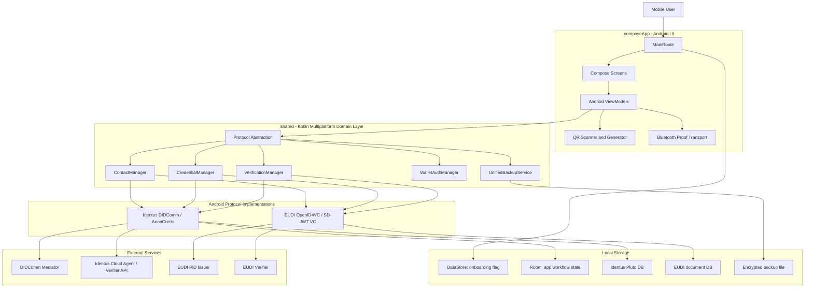
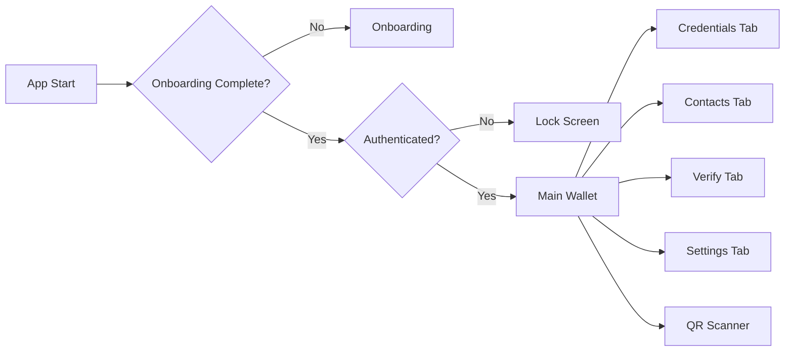
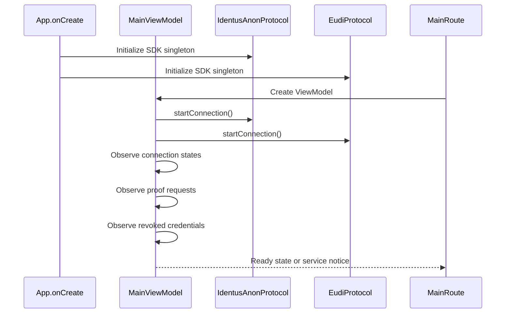
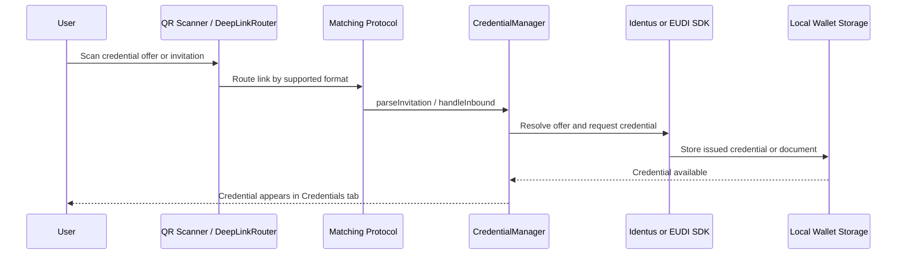
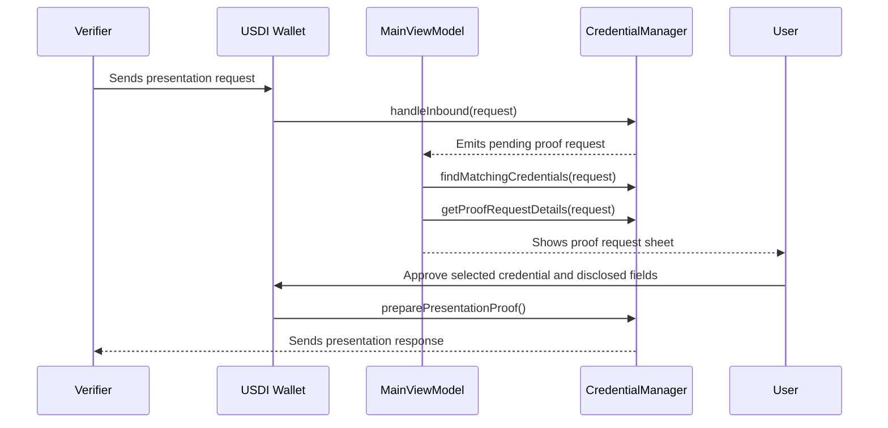
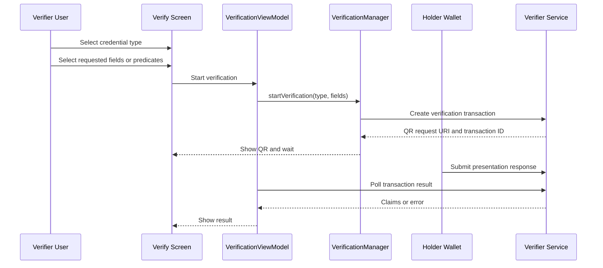
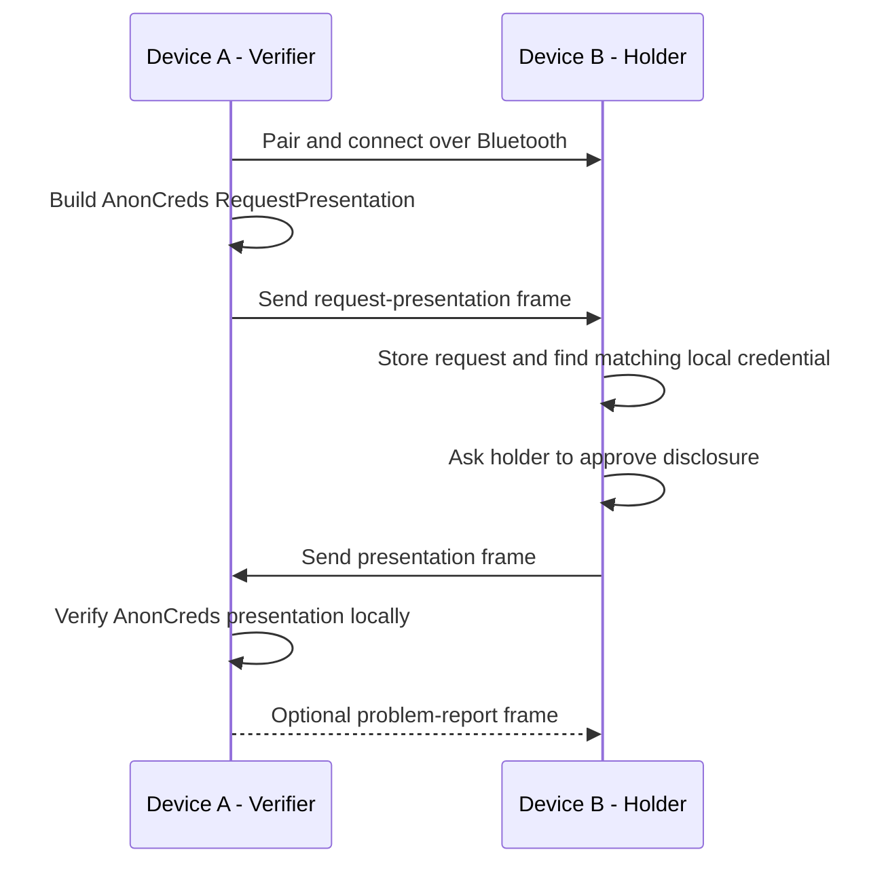
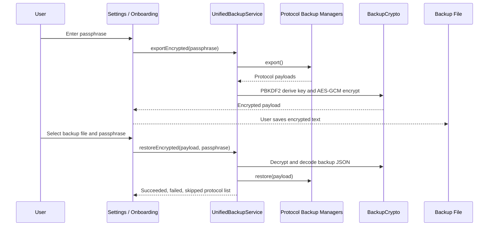

# USDI Wallet Feature and Architecture Overview

This document is written as PPT-ready content for explaining the USDI Wallet app features, system architecture, and main runtime flows.

## 1. App Summary

USDI Wallet is a mobile digital identity wallet built with Kotlin Multiplatform and Compose. It lets a holder receive, store, view, back up, restore, and present verifiable credentials. The app supports two credential ecosystems:

- Hyperledger Identus / DIDComm / AnonCreds
- EUDI OpenID4VC / SD-JWT VC / mobile identity document flows

The wallet can act as:

- Holder: receives credentials and responds to proof requests.
- Verifier: creates verification requests and checks holder presentations.

## 2. Main Features

| Feature Area | Description | User Value |
| --- | --- | --- |
| Onboarding | First-run flow to create a new wallet or restore an existing wallet backup. | Helps users start with a new or recovered wallet. |
| Wallet Lock | App lock screen and biometric/device credential authentication abstraction. | Protects access to wallet data. |
| Credential List | Shows credentials from both Identus AnonCreds and EUDI wallet storage. | Gives one place to inspect issued credentials. |
| Credential Detail | Displays issuer, subject, protocol, claim values, issue date, expiration, and revocation state. | Helps users understand what data each credential contains. |
| QR Scanner | Scans credential offers, presentation requests, DIDComm invitations, and OpenID4VC links. | Reduces manual input and supports real-world issuer/verifier flows. |
| Contact Management | Accepts DIDComm and OpenID4VC invitations. DIDComm contacts are shown from stored DID pairs. | Supports issuer, verifier, and peer relationship setup. |
| Holder Proof Response | Receives proof requests, finds matching credentials, shows requested disclosures, and lets the holder approve or deny. | Gives user control before sharing credential data. |
| Verifier Mode | Lets the app create verification sessions by choosing a credential type and requested fields. | Allows one mobile wallet to verify another user's credentials. |
| EUDI Remote Verification | Builds an EUDI verification request, displays QR content, and polls verifier results. | Supports OpenID4VP style remote presentation. |
| AnonCreds Bluetooth Verification | Sends local AnonCreds proof requests between paired Android devices over Bluetooth. | Enables offline holder proof exchange without cloud transport. |
| Backup and Restore | Exports protocol backup payloads into encrypted text and restores from an encrypted backup file. | Reduces risk of losing wallet state. |
| Service Health Notice | Shows startup or service warnings while still allowing local wallet usage. | Keeps the app usable when remote services are unavailable. |

## 3. Supported Protocols

| Protocol | Purpose in App | Main Implementation |
| --- | --- | --- |
| DIDComm / AnonCreds | DID connections, AnonCreds issuance, proof request handling, revocation alerts, local Bluetooth proof. | `IdentusAnonProtocol`, `IdentusAnonCredentialManager`, `IdentusDIDCommContactManager` |
| OpenID4VC / EUDI | EUDI credential offers, SD-JWT VC issuance, OpenID4VP presentation requests and verification sessions. | `EudiProtocol`, `EudiSdJwtCredentialManager`, `EudiVerificationManager` |

## 4. High-Level Architecture

## 5. Module Responsibilities

| Module / Package | Responsibility |
| --- | --- |
| `composeApp` | Android app entrypoint, Compose UI, navigation, ViewModels, QR camera UI, Bluetooth transport UI integration. |
| `shared/domain` | Common interfaces and models: protocol, credential, contact, verification, auth, backup, connection state. |
| `shared/hyperledger_identus` | Hyperledger Identus SDK startup, DIDComm mediator handling, AnonCreds credential lifecycle, proof processing, revocation metadata, local Bluetooth proof logic. |
| `shared/eudi` | EUDI wallet startup, OpenID4VCI credential issuance, OpenID4VP presentation handling, EUDI verifier HTTP integration. |
| `shared/db` | Room database for app workflow state such as pending proof requests and read message IDs. |
| `shared/preferences` | Android DataStore preferences such as onboarding completion. |
| `iosApp` | iOS host project for the Kotlin Multiplatform shared framework. |

## 6. UI Navigation Structure

Main tabs:

- Credentials: list and inspect credentials.
- Contacts: accept invitations and show DIDComm contacts.
- Verify: create proof requests and view results.
- Settings: backup, restore, and about information.

## 7. Startup Flow

Startup behavior:

- Both protocol stacks are started in parallel.
- The UI can still show local wallet data if one service is offline.
- A startup timeout shows a non-blocking service notice.

## 8. Credential Issuance Flow

Notes:

- Identus handles DIDComm credential offers and issued credential messages.
- EUDI handles OpenID4VCI credential offers and issued documents.
- The Credential tab combines credentials from both protocols into one UI list.

## 9. Holder Proof Response Flow

User control:

- The wallet shows the verifier and requested fields.
- The user can approve with a matching credential or deny the request.
- For EUDI SD-JWT VC, selected disclosure labels are used to build the response.
- For AnonCreds, the manager creates an AnonCreds proof from the selected credential.

## 10. Verifier Flow

Current verifier modes:

- EUDI: QR-based remote verification through the EUDI verifier service.
- AnonCreds: QR proof invitations are disabled; local Bluetooth verification is used instead.

## 11. Local Bluetooth AnonCreds Proof Flow

Why this matters:

- The holder can respond without internet access.
- Bluetooth only transports the DIDComm proof messages.
- The verifier may still need network access to resolve schemas, credential definitions, or revocation data.

## 12. Backup and Restore Flow

Backup details:

- Key derivation: PBKDF2 with SHA-256, 100,000 iterations, 256-bit output.
- Encryption: AES-GCM.
- Backup content is grouped by protocol ID.
- Protocols without backup support are listed as skipped or non-recoverable.

## 13. Local Data Stores

| Store | File / Mechanism | Contents |
| --- | --- | --- |
| App Room DB | `usdi_wallet.db` | Pending proof requests and message read status. |
| Identus Pluto DB | `hyperledger_identus.db` | Identus SDK wallet state, DIDs, messages, credentials, metadata. |
| EUDI DB | `eudi.db` in no-backup storage | EUDI wallet documents and key-backed document data. |
| DataStore | `wallet_preferences` | Onboarding completion flag. |
| Backup File | User-selected text file | Encrypted protocol backup payload. |

## 14. External Services

| Service | Role |
| --- | --- |
| DIDComm mediator | Enables Identus DIDComm message routing and pickup when available. |
| Identus cloud agent / verifier API | Provides credential definitions and AnonCreds verification support. |
| EUDI PID issuer | Issues EUDI PID credentials through OpenID4VCI. |
| EUDI verifier | Creates OpenID4VP presentation requests and returns verification results. |

Configured URLs in the current app:

- Identus verifier base URL: `http://13.90.44.25:8085`
- EUDI issuer/verifier base URL: `https://usdi-wallet.duckdns.org`

## 15. Security and Privacy Notes

- Proof requests are shown to the holder before disclosure.
- The holder can deny a proof request.
- Backup files are encrypted with a user passphrase.
- EUDI document keys are configured with user authentication and StrongBox when available.
- Development note: the current Android auth manager has `BYPASS_WALLET_AUTH = true`, and `LockViewModel` currently authenticates automatically. Disable this bypass for production.
- Development note: the EUDI HTTP client currently trusts all TLS certificates for OpenID4VCI. Replace this with normal certificate validation for production.
- Development note: the Identus SDK seed is hardcoded in the current implementation. Production wallets should generate and protect a unique seed per user/device.

## 16. Suggested PPT Slide Structure

1. Title: USDI Wallet
2. Problem and Goal: mobile wallet for receiving and proving digital credentials
3. Main Features: use the feature table from section 2
4. Supported Protocols: compare Identus AnonCreds and EUDI OpenID4VC
5. High-Level Architecture: use the architecture diagram from section 4
6. App Navigation: use the navigation diagram from section 6
7. Credential Issuance Flow: use section 8 sequence diagram
8. Holder Proof Response: use section 9 sequence diagram
9. Verifier Mode: use section 10 sequence diagram
10. Bluetooth Offline Proof: use section 11 sequence diagram
11. Storage and Backup: combine sections 12 and 13
12. Security Notes and Future Improvements: use section 15

## 17. PPT Drawing Tips

- Use four main architecture layers: UI, Domain Interfaces, Protocol Implementations, Storage and External Services.
- Use different colors for Identus and EUDI protocol paths.
- Put QR Scanner and Bluetooth Transport beside the UI layer because they are device capabilities used by ViewModels.
- Draw Storage as a bottom layer because both protocols write local state.
- Draw External Services as a right-side layer because they are optional network dependencies.
- For flow diagrams, use sequence diagrams when explaining user interaction and message exchange.

