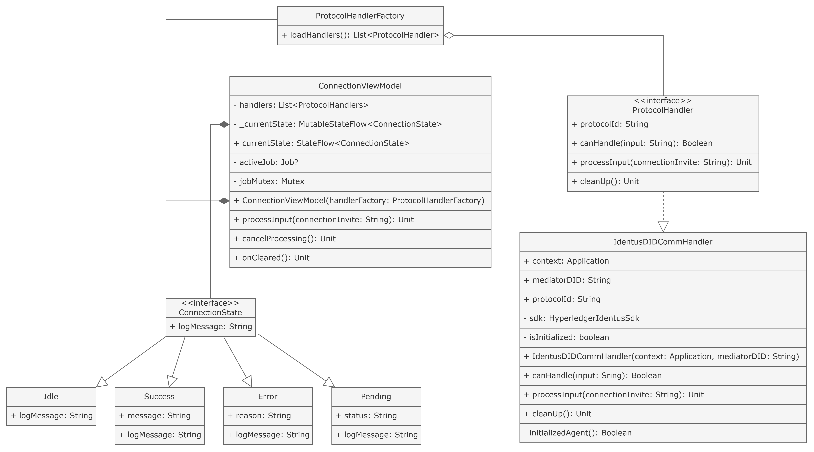
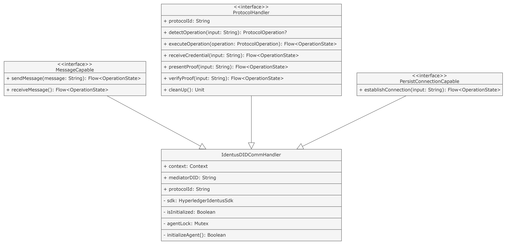

# How to run Connection Module

***Update**: Currently, the module is only capable of establishing connection with the mediator. Next steps will involve establishing connection with another device through the mediator and exchange messages.*

## Store Github account and token in your Gradle directory
### Window
1. Go to your global `.gradle` directory `C:\Users\\\<username\>\\.gradle\\`
2. Create a file called `gradle.properties` (if not exist) and add your credentials:
```shell
gpr.user=YOUR_GITHUB_USER_NAME
gpr.key=YOUR_GITHUB_TOKEN
```

### Linux
1. Create / edit `gradle.properties` in global `.gradle` directory:
```shell
$ cd ~/.gradle
$ sudo nano gradle.properties
```
2. Add your credentials to `gradle.properties`:
```shell
gpr.user=YOUR_GITHUB_USER_NAME
gpr.key=YOUR_GITHUB_TOKEN
```
3. Save your changes with `Ctrl + O` then `Enter` and `Ctrl + X` to exit.


## Module Orchestration

### Overview


- `ConnectionManager` is the main entity governing all different handlers. This class should be singleton.
- `ProtocolHandler` is the unified interface for connection protocols. New protocol must implement this class.
- `ProtocolHandlerFactory` returns a list of `ProtocolHandler`s. This is an `expect class`, thus needs to have an actual implementation for each platform.
- `OperationState` acts as an enum for connection states.
- `ProtocolOperation` acts as an enum for available operations of a protocol.

### Sample implementation of `ProtocolHandler`


- Each `ProtocolHandler` can detect operation (establish connection with mediator, receive credential, present proof, etc.) from invitation / server response through `detectOperation` method, which returns a `ProtocolOperation`. This is then passed to `executeOperation` acting as a switch that calls the corresponding *operation*.
- Each *handler* must have at least 3 operations: `receiveCredential`, `presentProof` and `verifyProof`. Other functionalities can be added through inheritance (`PersistConnectionCapable` adds `establishConnection` method, whereas `MessageCapable` adds `sendMessage` and `receiveMessage`).

## Run Connection Module Demo
This demo focuses on setting up DIDComm v2 using the SDKs provided by Hyperledger Identus. The SDKs used are:
- [Hyperledger-Identus/sdk-kmp](https://github.com/hyperledger-identus/sdk-kmp)
- [Hyperledger-Identus/cloud-agent](https://github.com/hyperledger-identus/cloud-agent)
- [Hyperledger-Identus/mediator](https://github.com/hyperledger-identus/mediator)

### Some useful documentation
- [Hyperledger-Identus/cloud-agent `README.md`](https://github.com/hyperledger-identus/hyperledger-identus): Read this first to understand the general orchestration of Hyperledger Identus modules and how they work with each other.
- [Hyperledger Identus official documentation](https://hyperledger-identus.github.io/docs/): Hyperledger Identus documentation hub for basic understanding and links to various different SDK documentations.
- [Cloud agent swagger](http://localhost:8085/docs) (access this after finish setting up local cloud agent)

### Run Hyperledger-Identus/identus-docker suite

1. In a separate terminal, clone the mediator repository and open it in your IDE.
    ```shell
    $ git clone https://github.com/hyperledger-identus/hyperledger-identus
    ```

2. Modify instances of local docker network endpoint such as `http://cloud-agent` or `http://identus-mediator` to your host machine IPv4
    ```yaml
    services:
      cloud-agent:
        environment:
          ...
          - POLLUX_STATUS_LIST_REGISTRY_PUBLIC_URL: http://<your-host-ip>:8085
          - DIDCOMM_SERVICE_URL: http://<your-host-ip>:8090
          - REST_SERVICE_URL: http://<your-host-ip>:8085
    
      identus-mediator:
        environment:
          ...
          # Original
          # - SERVICE_ENDPOINTS=${SERVICE_ENDPOINTS:-http://localhost:8080;ws://localhost:8080/ws}
          # This demo uses an Pixel 8 Emulator, thus in order for it to "see" the mediator endpoints hosted on the same machine, we replace `localhost` with `10.0.2.2`
          - SERVICE_ENDPOINTS=${SERVICE_ENDPOINTS:-http://<your-host-ip>:8080;ws://<your-host-ip>:8080/ws}
          ...
    ```

    then run docker compose:
    ```shell
    $ cd identus-docker/
    $ docker compose up 
    ```
    Or
    ```shell
    $ docker-compose up 
   ```
   

### Issue a new certificate

1. Create a new DID for the issuer. I will refer to the DID in the response as `didRef`:
    ```shell
    $ curl -X 'POST' \
      'http://localhost:8085/did-registrar/dids' \
      -H 'Content-Type: application/json' \
      -d '{
      "documentTemplate": {
        "publicKeys": [
          {
            "id": "auth-1",
            "purpose": "authentication"
          },
          {
            "id": "assertion-1",
            "purpose": "assertionMethod"
          }
        ],
        "services": []
      }
    }'
    ```

2. Publish the DID to VDR:
    ```shell
    $ curl -X 'POST' \
      'http://localhost:8085/did-registrar/dids/{didRef}/publications' \
      -H 'accept: application/json' \
      -d ''
    ```

3. Create a new credential schema. Take note of the schema `id` attribute in the response, since we will use it later:
    ```shell
    $ curl -X 'POST' \
      'http://localhost:8085/schema-registry/schemas' \
      -H 'accept: application/json' \
      -H 'Content-Type: application/json' \
      -d '{
      "name": "FaberCollegeGraduate",
      "version": "1.0.0",
      "description": "Simple credential schema for the university graduate verifiable credential.",
      "type": "https://w3c-ccg.github.io/vc-json-schemas/schema/2.0/schema.json",
      "schema": {
        "$id": "https://example.com/university-graduate-1.0",
        "$schema": "https://json-schema.org/draft/2020-12/schema",
        "description": "University graduate",
        "type": "object",
        "properties": {
          "emailAddress": {
            "type": "string",
            "format": "email"
          },
          "givenName": {
            "type": "string"
          },
          "familyName": {
            "type": "string"
          },
          "dateOfIssuance": {
            "type": "string",
            "format": "date-time"
          },
          "faculty": {
            "type": "string"
          },
          "gpa": {
            "type": "number"
          }
        },
        "required": [
          "emailAddress",
          "familyName",
          "dateOfIssuance",
          "faculty",
          "gpa"
        ],
        "additionalProperties": false
      },
      "tags": [
        "university",
        "graduate",
        "id"
      ],
      "author": "{didRef}"
    }'
    ```

4. Create a Connection Invitation, then paste the `invitationUrl` value in the response to our app. Also take note of the `connectionId`, as we need to use it later:
    ```shell
    $ curl -X 'POST' \
      'http://localhost:8085/connections' \
      -H 'accept: application/json' \
      -H 'Content-Type: application/json' \
      -d '{
      "label": "test-wallet-300126-1651",
      "goalCode": "issue-vc",
      "goal": "To issue a Faber College Graduate credential"
    }'
    ```

5. Wait some moment (or call this API to check) for the connection state to become `ConnectionResponseSent`:
    ```shell
    $ curl -X 'GET' \
      'http://localhost:8085/connections/{connectionId}' \
      -H 'accept: application/json'
    ```

6. Now everything is set! We can issue a simple certificate:
    ```shell
    $ curl -X 'POST'   'http://localhost:8085/issue-credentials/credential-offers'   -H 'Content-Type: application/json'   -d '{
      "validityPeriod": 3600,
      "credentialFormat": "JWT",
      "claims": {
        "emailAddress": "alice@wonderland.com",
        "givenName": "Alice",
        "familyName": "Wonderland",
        "dateOfIssuance": "2024-01-30T00:00:00Z",
        "faculty": "Computer Science",
        "gpa": 3
      },
      "schemaId": "http://192.168.105.44:8085/schema-registry/schemas/8a46cfe9-4ef7-375e-8243-c4c28547b77a/schema",
      "credentialDefinitionId": "8a46cfe9-4ef7-375e-8243-c4c28547b77a",
      "automaticIssuance": true,
      "connectionId": "46f89354-9066-4e77-9ef4-1fda32465c66",
      "issuingDID": "did:prism:1264d16d2c119bc731453dfc24bb8c0651696b98e7e8cc4d15977a8a5a00c348",
      "goalCode": "issue-vc",
      "goal": "test-wallet",
      "domain": "faber-college-jwt-vc"
      }'
    ```

### Run the application

Please use an Android development IDE (IntelliJ IDEA, Android Studio, etc.) to run the app on an emulator for now. Other methods will be updated later.
