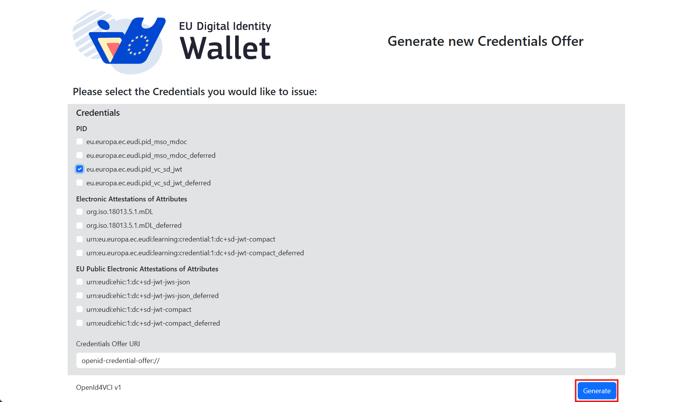
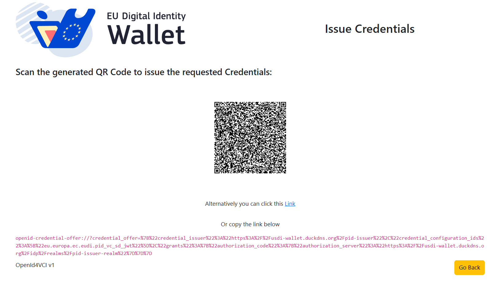
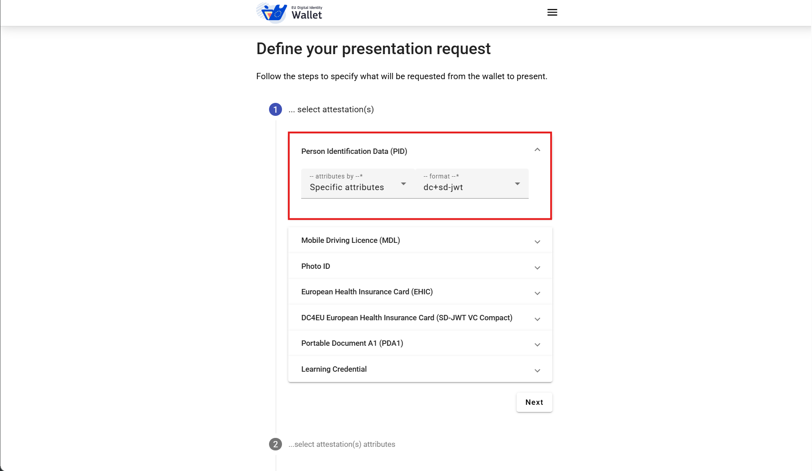
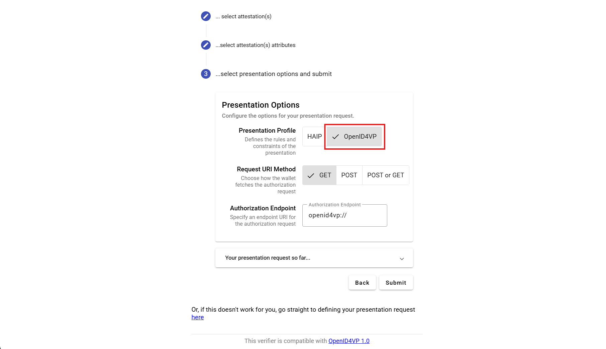
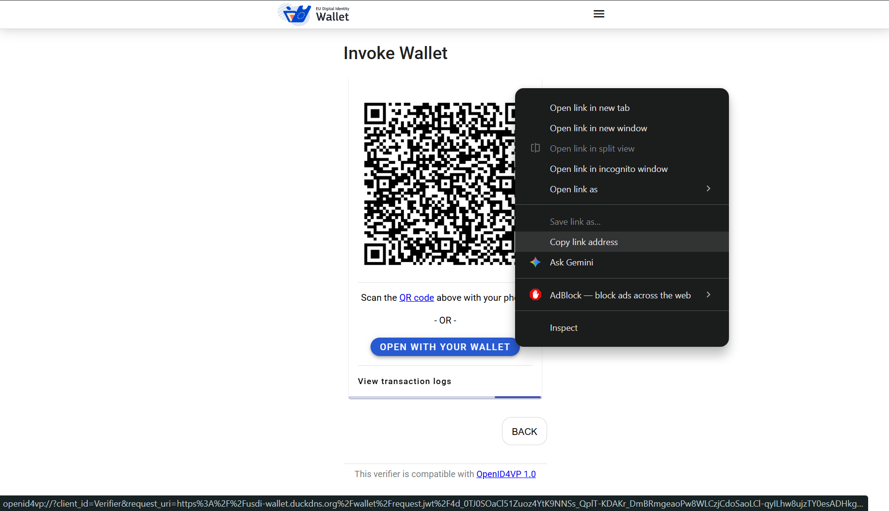

# How to run EUDI full flow

## Prerequisites
### Store Github account and token in your Gradle directory
#### Window
1. Go to your global `.gradle` directory `C:\Users\\\<username\>\\.gradle\\`
2. Create a file called `gradle.properties` (if not exist) and add your credentials:
```shell
gpr.user=YOUR_GITHUB_USER_NAME
gpr.key=YOUR_GITHUB_TOKEN
```

#### Linux
1. Create / edit `gradle.properties` in global `.gradle` directory:
```shell
$ cd ~/.gradle
$ sudo nano gradle.properties
```
2. Add your credentials to `gradle.properties`:
```shell
gpr.user=YOUR_GITHUB_USER_NAME
gpr.key=YOUR_GITHUB_TOKEN
```
3. Save your changes with `Ctrl + O` then `Enter` and `Ctrl + X` to exit.

## EUDI SD-JWT
Before you proceed, please read the [EUDI Wallet Reference Implementation project description](https://github.com/eu-digital-identity-wallet/.github/blob/main/profile/reference-implementation.md).

1. First, go to [PID-Issuer website](https://usdi-wallet.duckdns.org/pid-issuer) to generate a PID SD-JWT credential offer:
    
2. If you are already on your phone with the wallet app installed, you can click the link directly. Else, you can also scan the QR code or copy the URL and paste it into _Add new contact_ dialog:
    
3. The app should now automatically redirect to a browser, where you are asked to log in to an authentication server (Keycloak). Login to using test credentials:
    - Username: tneal
    - Password: password
4. The browser should redirect back to the app, and after a short while, a credential should be issued.
5. To trigger presentation flow, go to [verifier website](https://usdi-wallet.duckdns.org/), select PID, specify format as `dc+sd-jwt`
   
6. Select attributes you want to verify, then select OpenID4VP as the presentation option:
   
7. After submitting, if you are already on your phone with the app installed, you can scan the QR code or click _OPEN WITH YOUR WALLET_ button directly. Else, you can copy the link embedded on the _OPEN WITH YOUR WALLET_ button and paste it into the app's _Add new contact_ dialog.
   
8. After submitting the request on the app, the verifier website will display the credential with all the submitted fields.